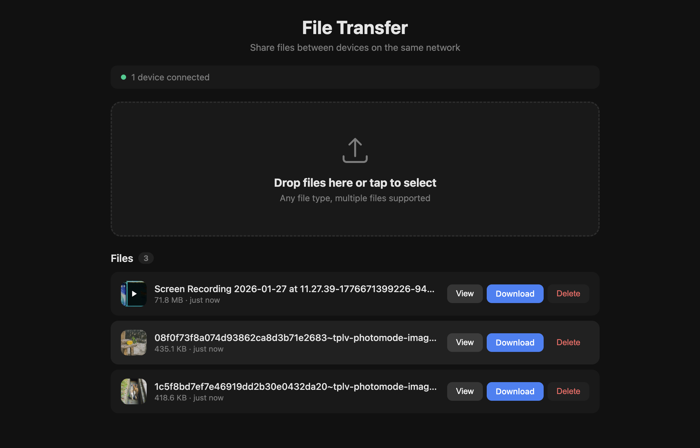

# file-transfer

Self-contained production bundle of the LAN file-sharing app.
UI (React) is pre-built into `src/assets/public/` and served by the Express API at `/`.



## Install & run

```bash
npm install --omit=dev     # or: pnpm install --prod
node main.js               # or: npm start
```

Server listens on `http://0.0.0.0:3005` by default. Share the `Network` URL
printed on startup with other devices on the same LAN.

## Environment variables

| Name             | Default     | Purpose                              |
| ---------------- | ----------- | ------------------------------------ |
| `FT_HOST`        | `0.0.0.0`   | Interface the API binds to           |
| `FT_PORT`        | `3005`      | API port                             |
| `FT_UPLOADS_DIR` | `./uploads` | Where uploaded files are stored      |

## Endpoints

- `GET  /`                     — React UI
- `GET  /files`                — list uploaded files
- `POST /upload`               — multipart upload (field: `files`, supports multiple)
- `GET  /preview/:filename`    — inline view (used by UI thumbs & modal)
- `GET  /download/:filename`   — download (attachment)
- `DELETE /files/:filename`    — delete
- Socket.IO at `/socket.io/`   — emits `files:new`, `files:deleted`, `devices:update`
